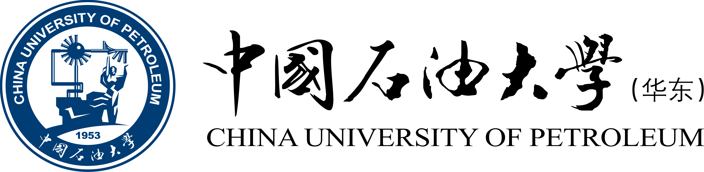

# 中国石油大学（华东） 课程资料共享
## 软件工程专业 本科资料

### 我们是谁？
- 我们致力于知识的无条件推广
- 本校相关专业在校学生
- 使用资料请遵守 [CC BY-SA 4.0](https://creativecommons.org/licenses/by-sa/4.0/deed.zh "CC BY-SA 4.0") 协议和MIT开源协议

**注：为了保护任课教师的隐私，我们删去了课件中相关教师的办公室房间或手机等联系方式（但保留了邮箱地址），若有不妥可联系删除！**

> 资料陆续整理上传中，目录稍后开放。

### E.O.F.